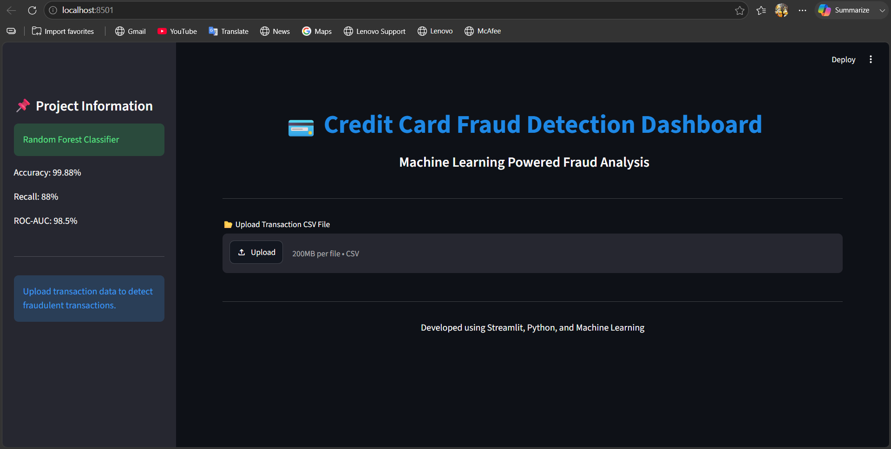

# 💳 Credit Card Fraud Detection System

A Machine Learning-based web application built using Streamlit that detects fraudulent credit card transactions.

## Dashboard Preview

 

## 🚀 Features

- Upload transaction CSV files
- Detect fraudulent transactions using Random Forest Classifier
- Interactive dashboard
- Fraud distribution visualization
- Download prediction results
- Dark mode UI

## 📊 Model Performance

| Metric | Value |
|----------|----------|
| Accuracy | 99.88% |
| Precision | 60% |
| Recall | 88% |
| F1-Score | 71% |
| ROC-AUC | 98.5% |

## 🛠️ Technologies Used

- Python
- Pandas
- Scikit-Learn
- Streamlit
- Matplotlib
- Random Forest Classifier
- SMOTE

## 📂 Dataset

Credit Card Fraud Detection Dataset

Features:
- Time
- V1 to V28
- Amount

Target:
- Class (Fraud / Genuine)

## ▶️ Run Locally

```bash
pip install -r requirements.txt
streamlit run app.py
```


## Author

Priyanshu Jaglan
B.Tech CSE (AI)